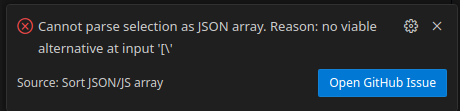
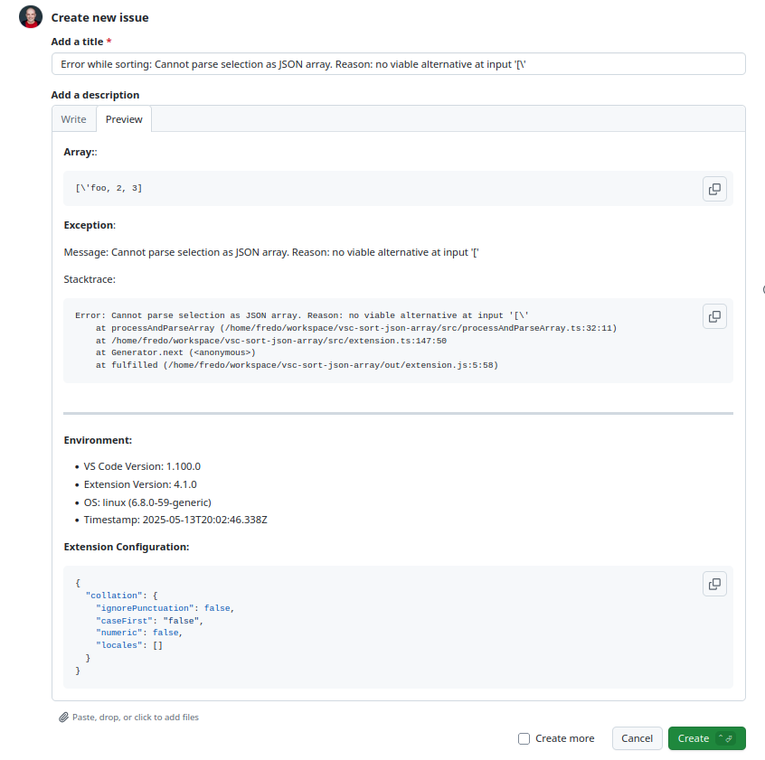

<a name="5.0.0"></a>
## 5.0.0
* Adds support for inline and single line comments #40

All the following are supported now:
```json
[ // start of array
    // comment before object
    { // comment at start of object
        // comment before property
        "id": 2, // comment at property
        // comment after property
    } // comment at end of object
    // comment at the end of array
]
```
* Adds support for block and multi line comments #44

JSONC is no fully supported:
```json
    [ /* start of array */
      /*
       * comment before object
       */
      { /* comment start of object */
        "id": 1, /* comment for property */
        /*
         * comment end of object
         */
      }, /* comment after object */
      /* comment at the end */
    ]`
```
* Fixes problem parsing backslashes at the end of a string: `"foo\\"` #45

* Adds an 'Open GitHub Issue' button to all error messages #41





<a name="4.1.0"></a>
## 4.1.0
* Improves text for property selection #27

| Before | After |
| --- | --- | 
| |  |
| |  |

* Adds support for all whitespace and formatting characters #14
* Show sort commands in command palette only for the Javascript programming language family #4


<a name="4.0.0"></a>
## 4.0.0
* Supports unquoted object properties #7
* Updates dependencies to fix audit issues

<a name="3.1.0"></a>
## 3.1.0
* Strings are sorted using lexicographic order instead of code point order #23

<a name="3.0.1"></a>
## 3.0.1
* Fixes wrong handling of escape characters #17

<a name="3.0.0"></a>
## 3.0.0
* Adds custom JSON parser that is able to parse single quotes and dangling commas

<a name="2.0.3"></a>
## 2.0.3
* Clarifies auto detection error message

<a name="2.0.2"></a>
## 2.0.2
* Adds error message for auto detection on vscode < 1.44

<a name="2.0.1"></a>
## 2.0.1
* Set required vscode version to 1.44

<a name="2.0.0"></a>
## 2.0.0
* Detection of array enclosing cursor
* Support for .jsonl files

<a name="1.1.0"></a>
## 1.1.0
* Documentation for new sort modules
