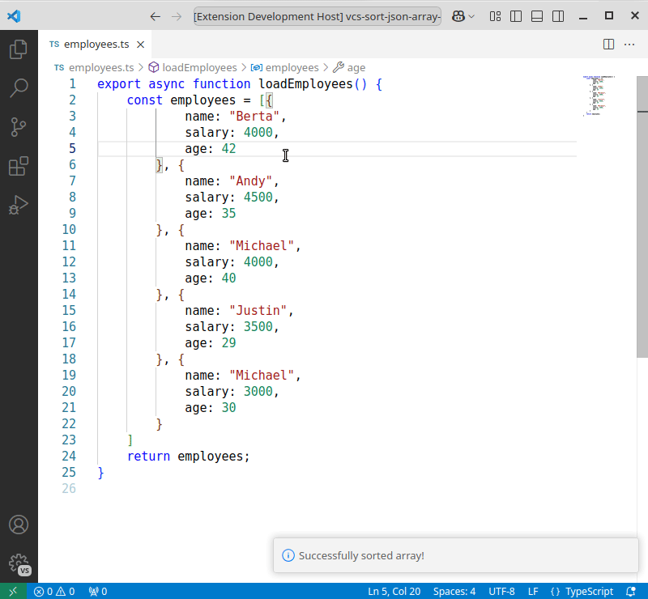

# Sort JSON array

Sorts a json/js array by common property or by custom function and replace the array in-place. Also works for numbers and string arrays. Nested objects and mixed arrays are only supported by custom function.

## Demo

* Sort array of objects ascending or descending by one or more properties to produce a deterministic sort result:  

* Sort array using custom function:  

* Manage sort modules:  

## Features

Selecting an array works well with the `editor.action.smartSelect.grow` keyboard shortcut or a simliar expand-selection shortcut.

### Sort number, string or object arrays
String arrays are sorted using the lexicographic order. Number arrays are sorted based on their value. Objects are sorted based on one or more properties. The program will ask until the sort is deterministic. There is command for ascending and descending sort.

### Custom sort
Custom sort opens the sort module in another tab. The sort module must be a valid typescript module that exports a `sort(a, b): number` function. Typing of `a` and `b` can be arbitrary. Every time the module is saved, it will be evaluted and applied to the selected array. A preview of the sort function applied to the current array will be displayed in the output view. Any error in the sort module will be displayed as error message. When the sort module (= tab) is closed, it will be applied to the array of the file where the command was triggered. 

For older vscode versions: Opening the sort module in another tab only works properly if preview mode is disabled. Set `workbench.editor.enablePreview` to `false`. There is also some simple module management, including delete and rename functionality. New sort module will always be named `sort.xx.ts`.

Technical: Sort modules are stored in the global storage path location for this extension. This is a folder in your vs code config location.
